# SOFA 서비스 백서

> **SOFA: Smart Operator's FAQ Assistant**
>
> 한국 중소기업을 위한 RAG 기반 멀티테넌트 AI 챗봇 SaaS 플랫폼

**버전**: 1.0
**작성일**: 2025년 1월

---

## 목차

1. [Executive Summary](#1-executive-summary)
2. [시장 기회 및 문제 정의](#2-시장-기회-및-문제-정의)
3. [솔루션 개요](#3-솔루션-개요)
4. [기술 아키텍처](#4-기술-아키텍처)
5. [비즈니스 모델](#5-비즈니스-모델)
6. [플랫폼 기능 상세](#6-플랫폼-기능-상세)
7. [보안 및 규정 준수](#7-보안-및-규정-준수)
8. [기술 스택 및 인프라](#8-기술-스택-및-인프라)
9. [경쟁 분석](#9-경쟁-분석)
10. [로드맵 및 향후 계획](#10-로드맵-및-향후-계획)

---

## 1. Executive Summary

### 핵심 메시지

SOFA는 **한국 중소기업의 고객 응대 자동화**를 위해 설계된 **RAG(Retrieval-Augmented Generation) 기반 멀티테넌트 챗봇 SaaS**입니다. 기존 FAQ 챗봇의 한계를 넘어, 기업의 문서를 학습하여 자연스러운 대화형 고객 응대를 제공합니다.

### 문제 정의

한국의 780만 중소기업 중 상당수가 제한된 인력으로 반복적인 고객 문의에 대응하고 있습니다. 기존 챗봇 솔루션은 시나리오 기반으로 구축 비용이 높고, 유지보수가 어려우며, 고객 만족도가 낮습니다.

### 솔루션 요약

SOFA는 기업이 보유한 문서(FAQ, 매뉴얼, 정책 등)를 업로드하면, AI가 자동으로 학습하여 고객 질문에 정확하게 답변합니다. **코딩 없이 10분 만에 배포** 가능하며, 웹 위젯과 카카오톡 채널을 통해 서비스됩니다.

### 핵심 지표

| 지표 | 수치 |
|------|------|
| 평균 응답 시간 | **2.5초** (업계 평균 5-10초) |
| 첫 질문 응답 시간 | **2.2초** |
| 벡터 검색 속도 | **50ms** (10만 청크 기준) |
| 검색 정확도 | **Faithfulness 0.9+** |

### 기술 차별점 3가지

1. **Hybrid Retrieval**: Dense(벡터) + Sparse(BM25) 검색을 RRF로 융합하여 검색 정확도 극대화
2. **Intent-Aware RAG**: 질문 의도 분류 기반 응답 전략으로 할루시네이션 최소화
3. **한국어 최적화**: BGE-m3-ko 임베딩 모델로 영어 대비 +13.4% 성능 향상

---

## 2. 시장 기회 및 문제 정의

### 2.1 중소기업 고객 응대 현황

한국 중소기업의 고객 응대 현실:

- **인력 부족**: 평균 1-2명이 고객 응대 + 기타 업무 병행
- **반복 업무**: 문의의 70% 이상이 동일한 FAQ 반복
- **응대 시간 제한**: 주간 근무 시간에만 응대 가능
- **품질 불일치**: 담당자에 따른 응대 품질 편차

### 2.2 기존 솔루션의 한계

#### 시나리오 기반 챗봇
- 구축 비용: 500만원~수천만원
- 유지보수: 시나리오 수정마다 개발자 필요
- 한계: 예상 질문만 응대 가능

#### 콜센터/상담사
- 인건비: 월 200만원+ (1인 기준)
- 확장성: 수요 증가 시 인력 확충 어려움
- 품질: 담당자별 응대 품질 편차

#### 단순 FAQ 페이지
- 검색 불편: 고객이 직접 찾아야 함
- 자연어 미지원: 키워드 매칭만 가능
- 낮은 이용률: 고객의 30%만 활용

### 2.3 시장 규모 분석

```
TAM (전체 시장)
├── 글로벌 대화형 AI 시장: $15.7B (2024) → $49.9B (2030)
│   └── CAGR 21.5%
│
SAM (서비스 가능 시장)
├── 한국 AI 챗봇 시장: ₩3,500억 (2024)
│   └── 중소기업 타겟 세그먼트: ₩700억
│
SOM (획득 목표 시장)
└── 초기 타겟: 전자상거래, 서비스업 SME
    └── 목표: ₩35억 (1% 점유)
```

### 2.4 타겟 고객

| 세그먼트 | 특징 | 니즈 |
|---------|------|------|
| 전자상거래 | 높은 문의량, 24시간 운영 | 배송/교환/환불 자동 응대 |
| 서비스업 | 예약/가격 문의 반복 | 영업시간 외 응대 |
| 교육/컨설팅 | 커리큘럼/서비스 설명 | 일관된 정보 제공 |
| 제조/유통 | 제품 스펙/재고 문의 | 정확한 기술 정보 |

---

## 3. 솔루션 개요

### 3.1 제품 비전

> **"기업의 지식을 대화로 전환하다"**

SOFA는 기업이 보유한 모든 문서를 AI가 이해하고, 고객의 자연어 질문에 정확하게 답변하는 플랫폼입니다. 개발 지식 없이 누구나 10분 만에 AI 챗봇을 배포할 수 있습니다.

### 3.2 핵심 가치 제안

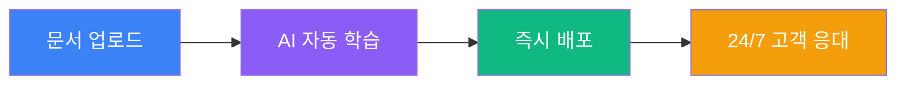

| 가치 | 설명 |
|------|------|
| **즉시 시작** | 문서 업로드 후 10분 내 배포 |
| **정확한 답변** | RAG 기반으로 문서 내용만 답변 |
| **24/7 운영** | 무인 상시 고객 응대 |
| **멀티 채널** | 웹 + 카카오톡 동시 지원 |
| **비용 절감** | 상담사 대비 90% 비용 절감 |

### 3.3 사용자 여정

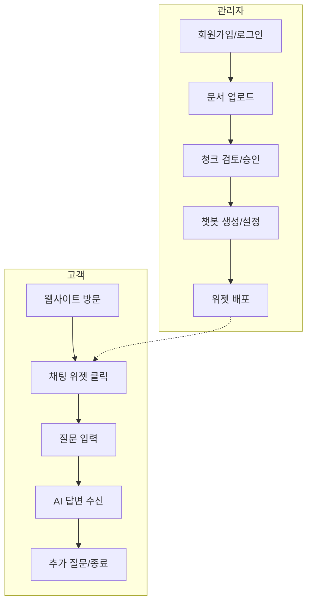

### 3.4 핵심 기능 목록

#### 문서 관리
- 다양한 포맷 지원: Markdown, TXT, PDF, DOCX
- 스마트 청킹: 의미 단위 자동 분리
- 품질 점수: 각 청크별 검색 적합도 평가
- 검토 시스템: 자동/수동 승인 워크플로우

#### 챗봇 구성
- 페르소나 설정: 말투, 역할, 제약 조건
- 데이터셋 연결: 복수 문서셋 매핑
- 위젯 커스터마이징: 색상, 위치, 초기 메시지

#### 채널 연동
- 웹 위젯: 스크립트 한 줄로 설치
- 카카오톡: 채널 연동 + 스킬 서버

#### 분석 및 모니터링
- 대화 내역: 전체 세션 기록
- 사용량 통계: 일별/월별 대화 수
- 품질 메트릭: 응답 만족도, 검색 정확도

---

## 4. 기술 아키텍처

### 4.1 시스템 아키텍처 개요

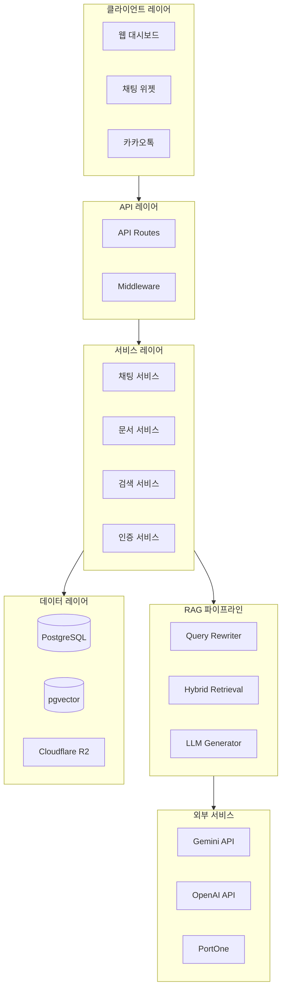

### 4.2 RAG 파이프라인 상세

SOFA의 핵심인 RAG(Retrieval-Augmented Generation) 파이프라인은 다음과 같이 구성됩니다:

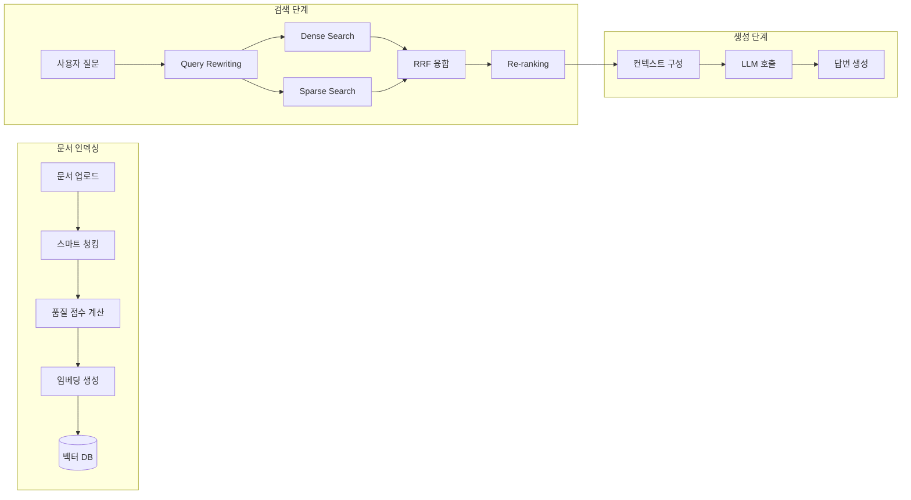

#### 4.2.1 Hybrid Retrieval (Dense + Sparse)

SOFA는 단일 검색 방식의 한계를 극복하기 위해 **Hybrid Retrieval**을 적용합니다:

| 검색 방식 | 기술 | 장점 | 가중치 |
|----------|------|------|--------|
| **Dense Search** | pgvector + BGE-m3-ko | 의미적 유사도 검색 | 0.7 |
| **Sparse Search** | PostgreSQL FTS + Nori | 키워드 정확 매칭 | 0.3 |

**RRF (Reciprocal Rank Fusion)** 알고리즘으로 두 결과를 융합:

```
RRF Score = Σ 1 / (k + rank_i)
```

- `k`: 융합 상수 (기본값: 60)
- `rank_i`: 각 검색 방식에서의 순위

#### 4.2.2 Query Rewriting

후속 질문에서 대명사, 생략된 주어를 복원하여 검색 정확도 향상:

```
이전 대화: "환불 정책은 무엇인가요?" → "7일 이내 가능합니다"
후속 질문: "그러면 개봉한 경우는?"
↓ Query Rewriting
재작성: "개봉한 상품의 환불 정책은 무엇인가요?"
```

- **첫 질문**: 재작성 없이 원본 사용 (레이턴시 최소화)
- **후속 질문**: Gemini 2.5 Flash-Lite로 빠른 재작성

### 4.3 스마트 문서 처리

#### 4.3.1 의미 기반 청킹

기존의 고정 크기 청킹 대신, **의미 단위**로 문서를 분할합니다:

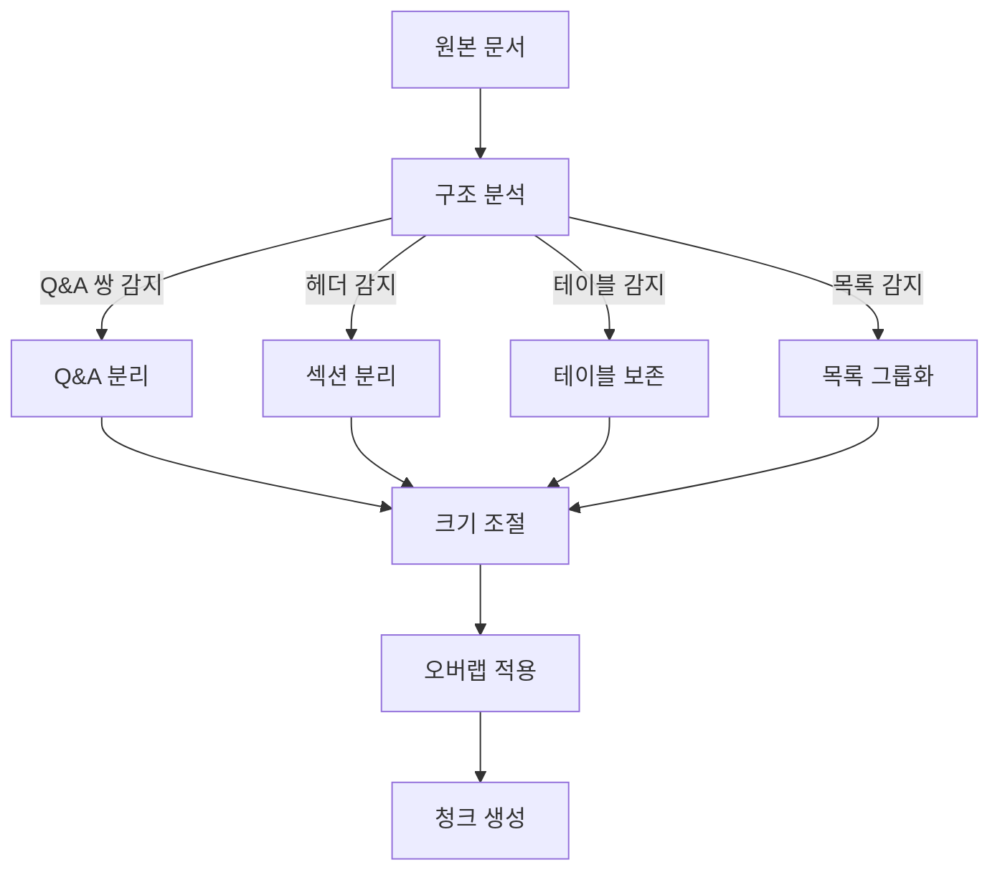

**청킹 설정**:
- 최대 청크 크기: 500자
- 오버랩: 50자
- 구조 보존: 활성화

**문서 구조 감지**:
- Markdown 헤더 (`#`, `##`, `###`)
- Q&A 쌍 (`Q:`, `A:`, `질문:`, `답변:`)
- 테이블 (`|...|...|`)
- 목록 (`-`, `*`, `1.`, `2.`)

#### 4.3.2 청크 품질 점수

각 청크에 0-100점의 품질 점수를 부여:

| 기준 | 감점/가점 |
|------|----------|
| 100자 미만 | -20점 |
| 800자 초과 | -10점 |
| 문장 중간 절단 | -15점 |
| Q&A 쌍 분리 | -30점 |
| 의미 없는 문자 다수 | -25점 |
| 완전한 Q&A 쌍 | +10점 |
| 헤더 포함 | +5점 |

**자동 필터링**: 제목/구분자만 있는 청크 자동 제외

### 4.4 성능 최적화

#### 4.4.1 응답 시간 최적화

**최적화 전후 비교**:

| 단계 | 최적화 전 | 최적화 후 | 개선 |
|------|----------|----------|------|
| 챗봇 조회 | 305ms | 50ms | -255ms |
| 세션 조회 | 42ms | 40ms | -2ms |
| 캐시 조회 | 898ms | 80ms | **-818ms** |
| 히스토리 조회 | 102ms | 50ms | -52ms |
| Query Rewriting | 1,115ms | 0ms* | **-1,115ms** |
| Hybrid Search | 814ms | 800ms | -14ms |
| LLM 생성 | 709ms | 700ms | -9ms |
| 메시지 저장 | 57ms | 50ms | -7ms |
| 캐시 저장 | 600ms | 30ms | **-570ms** |
| **총 소요시간** | **4,542ms** | **~2,500ms** | **-45%** |

*첫 질문에서는 Query Rewriting 생략

**핵심 최적화 기법**:

1. **캐시 유사도 검색 비활성화**: 해시 기반 정확 매칭으로 800ms 절감
2. **조건부 임베딩 스킵**: 불필요한 임베딩 생성 제거
3. **HNSW 인덱스**: 벡터 검색 O(n) → O(log n)

#### 4.4.2 HNSW 벡터 인덱스

대규모 데이터셋 대비 pgvector HNSW 인덱스 적용:

```sql
CREATE INDEX idx_chunks_embedding_hnsw
ON chunks USING hnsw (embedding vector_cosine_ops)
WITH (m = 16, ef_construction = 64);
```

**성능 개선**:
| 청크 수 | 인덱스 없음 | HNSW 적용 |
|---------|-----------|----------|
| 1만 | 500ms | 10ms |
| 10만 | 5-10초 | **50ms** |
| 100만 | 60초+ | 100ms |

#### 4.4.3 카카오톡 최적화

카카오톡 스킬 서버의 4초 타임아웃 대응:

1. **응답 시간 모니터링**: 3.5초 경과 시 폴백 응답
2. **스트리밍 불가 대응**: 전체 응답 완료 후 전송
3. **재시도 로직**: 실패 시 간소화된 응답 반환

### 4.5 RAG 평가 시스템

RAGAS 스타일의 4대 메트릭으로 품질 정량화:

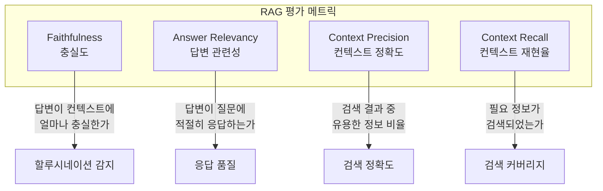

**권장 점수 기준**:

| 메트릭 | 우수 | 양호 | 개선 필요 |
|--------|------|------|----------|
| Faithfulness | ≥ 0.9 | 0.7-0.9 | < 0.7 |
| Answer Relevancy | ≥ 0.85 | 0.7-0.85 | < 0.7 |
| Context Precision | ≥ 0.8 | 0.6-0.8 | < 0.6 |
| Context Recall | ≥ 0.8 | 0.6-0.8 | < 0.6 |

**CLI 도구 제공**:
```bash
pnpm rag:evaluate --dataset data/evaluation/sample.json --markdown
```

---

## 5. 비즈니스 모델

### 5.1 티어별 가격 정책

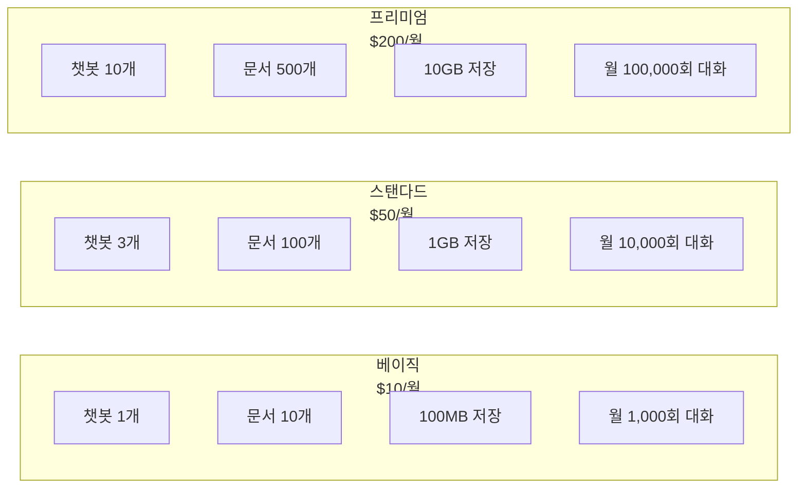

### 5.2 상세 비교표

| 기능 | 베이직 | 스탠다드 | 프리미엄 |
|------|--------|----------|----------|
| **월 구독료** | $10 | $50 | $200 |
| **챗봇 수** | 1개 | 3개 | 10개 |
| **데이터셋** | 1개 | 5개 | 20개 |
| **문서 수** | 10개 | 100개 | 500개 |
| **저장 용량** | 100MB | 1GB | 10GB |
| **월 대화 수** | 1,000회 | 10,000회 | 100,000회 |
| **문서당 청크** | 100개 | 500개 | 1,000개 |
| **API 요청/분** | 60 | 300 | 1,000 |
| **일일 채팅** | 100회 | 1,000회 | 10,000회 |
| **카카오톡 연동** | - | ✓ | ✓ |
| **우선 지원** | - | - | ✓ |

### 5.3 수익 구조

```
수익원
├── SaaS 구독료 (주력)
│   ├── 베이직: $10/월 × 고객수
│   ├── 스탠다드: $50/월 × 고객수
│   └── 프리미엄: $200/월 × 고객수
│
├── 사용량 초과 요금 (부가)
│   ├── 추가 대화: $0.01/회
│   └── 추가 저장: $1/GB/월
│
└── 엔터프라이즈 (향후)
    └── 커스텀 가격
```

### 5.4 단위 경제학

#### LLM 비용 구조

| 모델 | 입력 비용 | 출력 비용 | 용도 |
|------|----------|----------|------|
| Gemini 2.5 Flash-Lite | $0.10/1M | $0.40/1M | 메인 생성 |
| GPT-4o-mini | $0.15/1M | $0.60/1M | 폴백 |
| BGE-m3-ko | 자체 호스팅 | - | 임베딩 |

#### 티어별 예산 한도

| 티어 | 월 예산 | 일일 예산 | 경고 임계치 |
|------|--------|----------|------------|
| 베이직 | $10 | $0.33 | 80% |
| 스탠다드 | $50 | $1.67 | 80% |
| 프리미엄 | $200 | $6.67 | 80% |

#### 대화당 비용 분석

```
평균 대화 비용 (1회)
├── 임베딩 생성: $0.0001
├── 벡터 검색: $0.0005 (인프라)
├── LLM 생성: $0.002-0.005
└── 총: ~$0.003-0.006/대화

마진 분석 (스탠다드 기준)
├── 월 구독료: $50
├── 10,000회 × $0.004 = $40 (LLM 비용)
├── 인프라 비용: ~$5
└── 마진: ~$5-10 (10-20%)
```

---

## 6. 플랫폼 기능 상세

### 6.1 문서 관리

#### 지원 포맷

| 포맷 | 확장자 | 처리 방식 |
|------|--------|----------|
| Markdown | .md | 직접 파싱 |
| 텍스트 | .txt | UTF-8 인코딩 |
| PDF | .pdf | 텍스트 추출 |
| Word | .docx | XML 파싱 |

#### 문서 처리 워크플로우

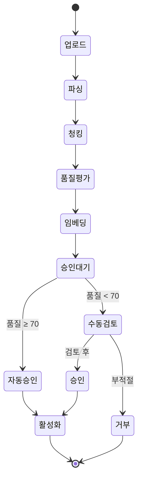

### 6.2 청크 검토 시스템

#### 상태 플로우

| 상태 | 설명 | 다음 상태 |
|------|------|----------|
| `pending` | 업로드 직후 | processing |
| `processing` | 청킹 진행 중 | pending_review |
| `pending_review` | 검토 대기 | approved / rejected |
| `approved` | 승인됨 (검색 가능) | - |
| `rejected` | 거부됨 | - |

#### 자동 승인 조건

- 품질 점수 70점 이상
- 문자 수 50자 이상
- 의미 있는 텍스트 비율 30% 이상

### 6.3 챗봇 구성

#### 페르소나 설정

```typescript
interface ChatbotPersona {
  name: string;           // 챗봇 이름
  role: string;           // 역할 (예: "고객 상담사")
  tone: string;           // 말투 (예: "친절하고 전문적인")
  constraints: string[];  // 제약 조건
  fallbackMessage: string; // 답변 불가 시 메시지
}
```

#### 데이터셋 매핑

- 하나의 챗봇에 복수 데이터셋 연결 가능
- 데이터셋별 우선순위 설정
- 실시간 데이터셋 활성화/비활성화

### 6.4 위젯 커스터마이징

#### 설정 옵션

| 옵션 | 설명 | 기본값 |
|------|------|--------|
| 위치 | 우하단/우상단/좌하단/좌상단 | 우하단 |
| 테마 색상 | HEX 컬러 | #3B82F6 |
| 초기 메시지 | 인사 메시지 | "안녕하세요!" |
| 버튼 아이콘 | 커스텀 이미지 | 기본 채팅 |
| 다크모드 | 자동/라이트/다크 | 자동 |

#### 설치 코드

```html
<script>
  window.SOFA_CONFIG = {
    chatbotId: 'YOUR_CHATBOT_ID',
    position: 'bottom-right',
    theme: '#3B82F6'
  };
</script>
<script src="https://widget.sofa.ai/v1/loader.js" async></script>
```

### 6.5 카카오톡 연동

#### 연동 방식

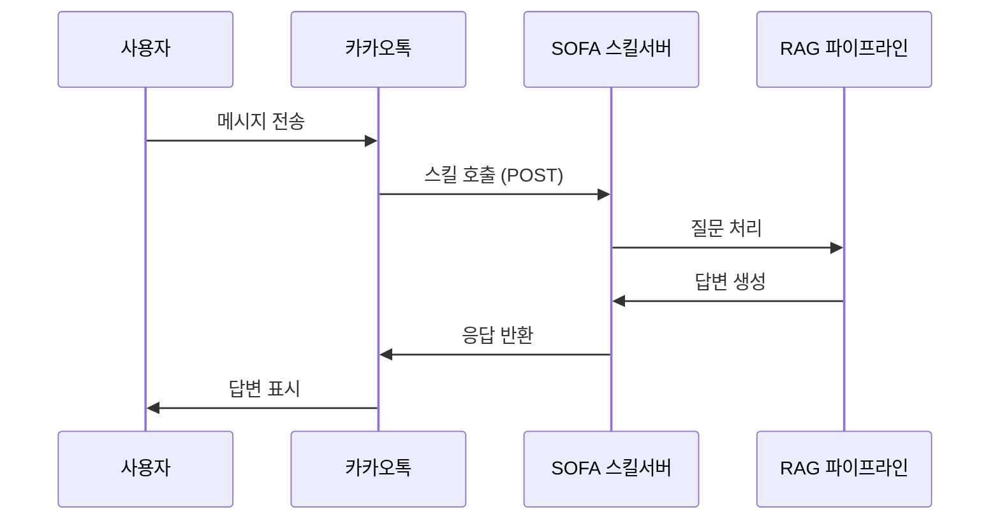

#### 4초 타임아웃 대응

1. 응답 시간 모니터링 (3.5초 경과 체크)
2. 타임아웃 임박 시 간소화된 응답
3. 비동기 처리 + 후속 메시지 발송

### 6.6 분석 및 모니터링

#### 대시보드 메트릭

```
일일 통계
├── 총 대화 수
├── 평균 응답 시간
├── 세션당 평균 메시지 수
└── 사용자 만족도 (선택)

월간 통계
├── 대화 추이 그래프
├── 피크 시간대 분석
├── 자주 묻는 질문 TOP 10
└── 답변 불가 질문 목록
```

---

## 7. 보안 및 규정 준수

### 7.1 인증 및 접근 제어

#### 인증 시스템

| 기능 | 구현 |
|------|------|
| 비밀번호 | bcrypt 해싱 (cost 12) |
| 세션 관리 | 서버사이드 세션 + CSRF 토큰 |
| 토큰 갱신 | 자동 리프레시 |
| 2FA | TOTP 기반 (선택) |

#### RBAC (역할 기반 접근 제어)

```
역할 계층
├── owner (소유자)
│   └── 모든 권한 + 소유권 이전
├── admin (관리자)
│   └── 설정 변경 + 멤버 관리
├── editor (편집자)
│   └── 문서/챗봇 편집
└── viewer (뷰어)
    └── 읽기 전용
```

### 7.2 데이터 보안

#### 멀티테넌트 격리

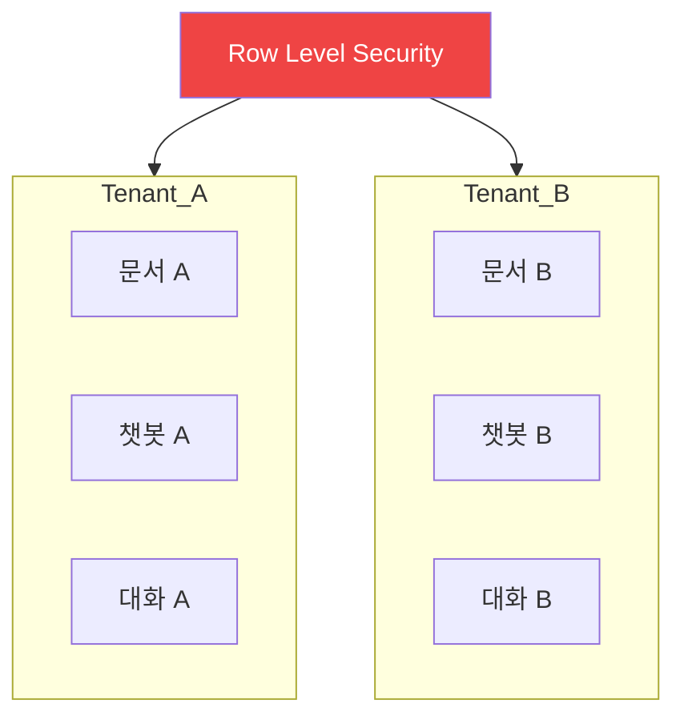

- **RLS (Row Level Security)**: PostgreSQL 정책으로 데이터 격리
- **테넌트 ID 검증**: 모든 API 요청에서 tenant_id 확인
- **크로스 테넌트 방지**: 데이터 접근 시 소유권 검증

#### 암호화

| 구간 | 방식 |
|------|------|
| 전송 중 | TLS 1.3 |
| 저장 시 | AES-256 (선택) |
| API 키 | 해시 저장 |

### 7.3 감사 로그

#### 기록 대상

- 로그인/로그아웃
- 권한 변경
- 문서 업로드/삭제
- 챗봇 설정 변경
- API 키 생성/폐기

#### 로그 형식

```json
{
  "timestamp": "2025-01-15T10:30:00Z",
  "tenantId": "tenant_xxx",
  "userId": "user_xxx",
  "action": "document.delete",
  "resource": "doc_xxx",
  "ipAddress": "1.2.3.4",
  "userAgent": "Mozilla/5.0..."
}
```

### 7.4 규정 준수

| 규정 | 대응 |
|------|------|
| 개인정보보호법 | 최소 수집, 암호화 저장, 삭제 요청 처리 |
| GDPR | 데이터 이동성, 삭제권 지원 |
| 정보통신망법 | 로그 보관, 접근 기록 |

---

## 8. 기술 스택 및 인프라

### 8.1 기술 스택 개요

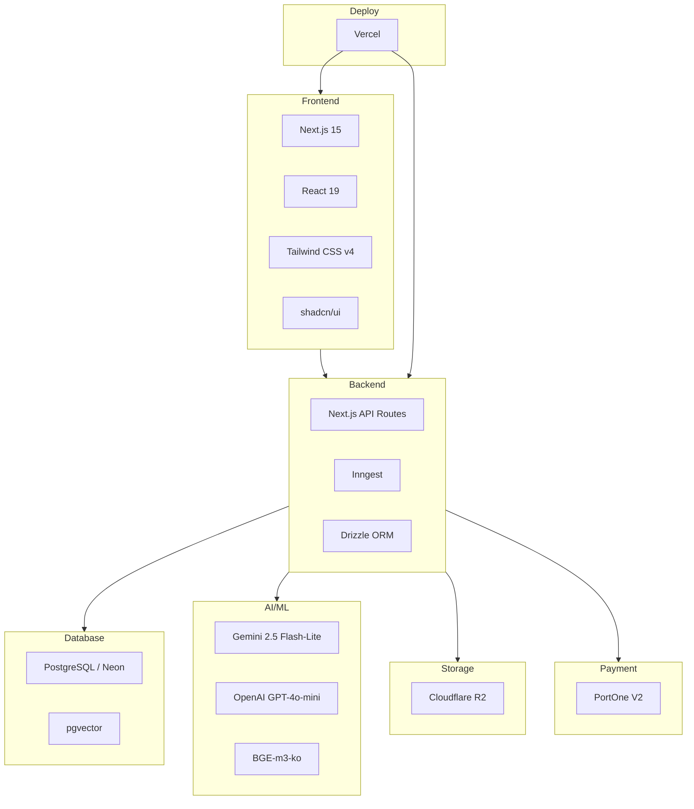

### 8.2 상세 기술 스택

#### 프론트엔드

| 기술 | 버전 | 용도 |
|------|------|------|
| Next.js | 15 | App Router 기반 풀스택 |
| React | 19 | UI 라이브러리 |
| TypeScript | 5.x | 타입 안전성 |
| Tailwind CSS | 4.x | OKLCH 컬러 시스템 |
| shadcn/ui | latest | Radix 기반 컴포넌트 |
| next-themes | latest | 다크/라이트 모드 |

#### 백엔드

| 기술 | 용도 |
|------|------|
| Next.js API Routes | RESTful API |
| Inngest | 백그라운드 작업 큐 |
| Drizzle ORM | 타입 안전 DB 쿼리 |

#### 데이터베이스

| 기술 | 용도 |
|------|------|
| PostgreSQL (Neon) | 서버리스 메인 DB |
| pgvector | 벡터 임베딩 저장/검색 |
| HNSW Index | 고속 ANN 검색 |

#### AI/ML

| 기술 | 용도 | 비용 |
|------|------|------|
| Gemini 2.5 Flash-Lite | 메인 LLM | $0.10/$0.40/1M |
| GPT-4o-mini | 폴백 LLM | $0.15/$0.60/1M |
| BGE-m3-ko | 한국어 임베딩 | 자체 호스팅 |

### 8.3 인프라 구성

```
Vercel (메인 배포)
├── Edge Network: 글로벌 CDN
├── Serverless Functions: API 처리
└── Build: CI/CD 파이프라인

Neon (데이터베이스)
├── Serverless PostgreSQL
├── Auto-scaling
└── Connection Pooling

Cloudflare R2 (스토리지)
├── 문서 파일 저장
├── S3 호환 API
└── 글로벌 배포

Inngest (작업 큐)
├── 문서 처리 워커
├── 임베딩 생성
└── 재시도 로직
```

### 8.4 개발 환경

```bash
# 필수 요구사항
Node.js >= 20.x
pnpm >= 8.x

# 환경 변수
DATABASE_URL=postgresql://...
GOOGLE_AI_API_KEY=...
OPENAI_API_KEY=...
PORTONE_API_SECRET=...
```

---

## 9. 경쟁 분석

### 9.1 경쟁 구도

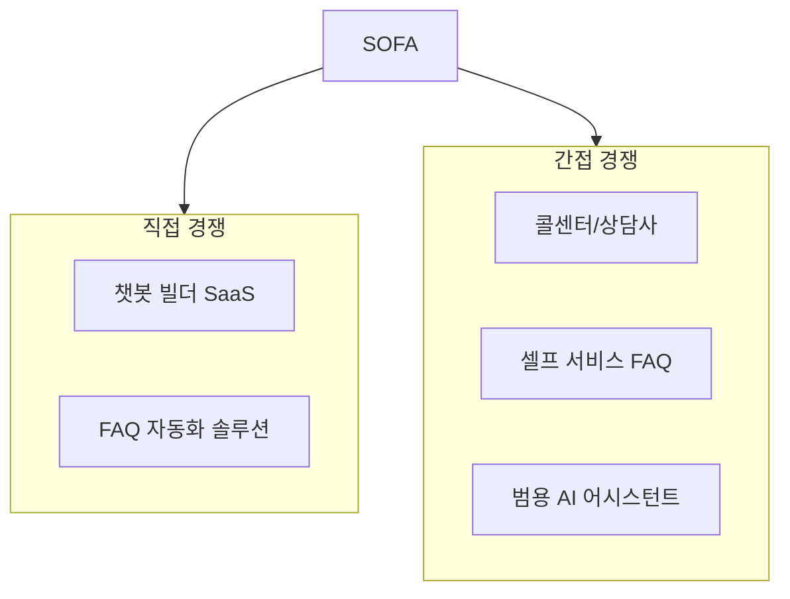

### 9.2 경쟁사 비교 매트릭스

| 기준 | SOFA | 챗봇 빌더 A | FAQ 솔루션 B | 콜센터 |
|------|------|-----------|-------------|--------|
| **초기 비용** | $10/월 | $500+ 구축비 | $100/월 | $2,000+/월 |
| **구축 시간** | 10분 | 2-4주 | 1-2주 | 1-3개월 |
| **자연어 이해** | ✓ RAG 기반 | △ 시나리오 | ✗ 키워드 | ✓ 인간 |
| **24/7 운영** | ✓ | ✓ | ✓ | ✗ 추가비용 |
| **학습 방식** | 문서 업로드 | 수동 시나리오 | 수동 입력 | 교육 필요 |
| **유지보수** | 자동 | 개발자 필요 | 담당자 필요 | 상시 관리 |
| **확장성** | 무제한 | 시나리오 수 제한 | FAQ 수 제한 | 인력 한계 |
| **한국어 지원** | ✓ 최적화 | △ 기본 | ✓ | ✓ |

### 9.3 SOFA 차별점

#### 1. 즉시 시작

```
기존 솔루션: 2-4주 구축 → 테스트 → 수정 → 배포
SOFA: 문서 업로드 → 10분 후 배포
```

#### 2. 지속적 학습

```
기존 솔루션: 새 질문 발생 → 시나리오 추가 요청 → 개발 → 배포
SOFA: 새 문서 업로드 → 자동 학습 → 즉시 반영
```

#### 3. 비용 효율

```
월 1만건 대화 기준
├── 콜센터: $2,000+ (인건비)
├── 챗봇 빌더: $200+ (유지보수 포함)
└── SOFA: $50 (스탠다드 티어)
```

#### 4. 한국어 최적화

- BGE-m3-ko: 한국어 특화 임베딩 (+13.4% 성능)
- Nori 형태소 분석: 정확한 키워드 검색
- 한국 서비스 연동: 카카오톡, 네이버, PortOne

---

## 10. 로드맵 및 향후 계획

### 10.1 완료된 개발 단계

#### Phase 1: 핵심 RAG 엔진 (완료)

- [x] Hybrid Retrieval (Dense + Sparse + RRF)
- [x] Intent-Aware RAG 파이프라인
- [x] 스마트 문서 청킹
- [x] 품질 점수 시스템
- [x] Query Rewriting

#### Phase 2: 플랫폼 기능 (완료)

- [x] 멀티테넌트 아키텍처
- [x] 사용자 인증/권한 시스템
- [x] 문서 관리 시스템
- [x] 챗봇 빌더
- [x] 웹 위젯
- [x] 카카오톡 연동
- [x] PortOne 결제 연동

### 10.2 향후 개발 계획

#### Phase 3: 고도화 (2025 Q1-Q2)

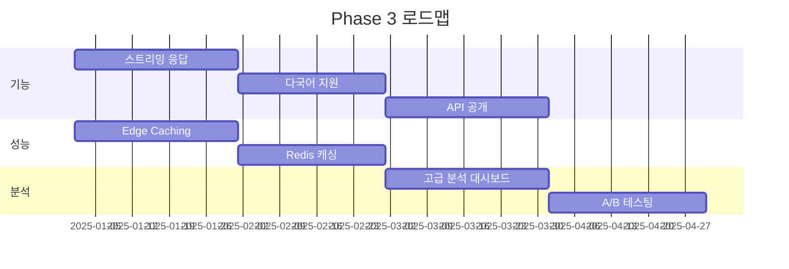

| 기능 | 설명 | 예상 시기 |
|------|------|----------|
| 스트리밍 응답 | LLM 응답 청크 단위 전송 | 2025 Q1 |
| 다국어 지원 | 영어, 일본어, 중국어 | 2025 Q1 |
| 공개 API | 외부 개발자용 REST API | 2025 Q2 |
| 고급 분석 | AI 기반 인사이트 | 2025 Q2 |

#### Phase 4: 확장 (2025 Q3-Q4)

| 기능 | 설명 | 예상 시기 |
|------|------|----------|
| 네이버 톡톡 | 추가 채널 연동 | 2025 Q3 |
| 에이전트 마켓플레이스 | 사전 구축된 챗봇 템플릿 | 2025 Q3 |
| 엔터프라이즈 | 온프레미스 배포, SSO | 2025 Q4 |
| 파트너 API | 화이트라벨 솔루션 | 2025 Q4 |

### 10.3 기술 로드맵

#### 성능 개선

```
현재: 2.5초 응답
├── 스트리밍: 체감 1초 미만
├── Edge Caching: 0.5초 캐시 히트
└── 목표: 체감 1초 미만
```

#### 모델 업그레이드

| 현재 | 계획 | 개선점 |
|------|------|--------|
| Gemini 2.5 Flash-Lite | Gemini 2.0 Pro | 복잡한 추론 |
| BGE-m3-ko | 자체 파인튜닝 | 도메인 특화 |
| 단일 언어 | 다국어 | 글로벌 확장 |

---

## 부록

### A. 용어 정의

| 용어 | 정의 |
|------|------|
| RAG | Retrieval-Augmented Generation, 검색 증강 생성 |
| 청크 | 문서를 분할한 단위 조각 |
| 임베딩 | 텍스트를 벡터로 변환한 수치 표현 |
| 할루시네이션 | LLM이 사실이 아닌 내용을 생성하는 현상 |
| RRF | Reciprocal Rank Fusion, 순위 융합 알고리즘 |
| HNSW | Hierarchical Navigable Small World, 근사 최근접 이웃 인덱스 |

### B. 참조 문서

- [RAG 평가 시스템](./RAG_EVALUATION.md)
- [채팅 성능 최적화](./CHAT_PERFORMANCE_OPTIMIZATION.md)
- [결제 연동 가이드](./billing-integration/README.md)

### C. 연락처

- **웹사이트**: https://sofa.ai
- **이메일**: support@sofa.ai
- **GitHub**: https://github.com/sofa-ai

---

*이 문서는 2025년 1월 기준으로 작성되었습니다.*
