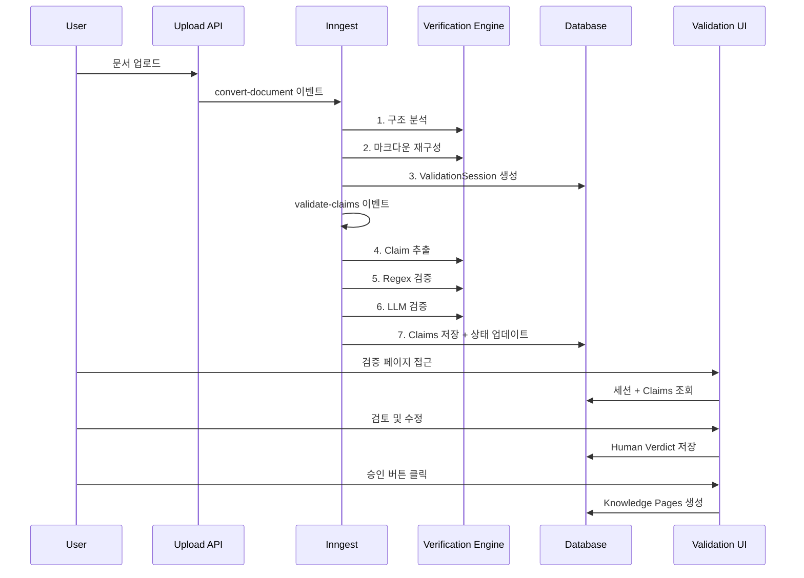
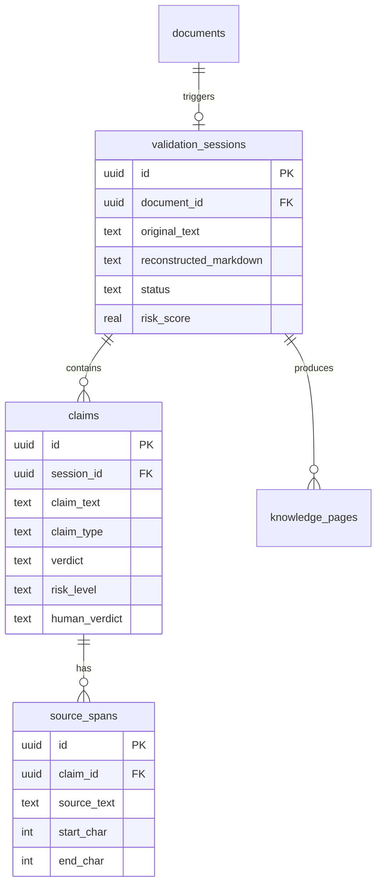

# Human-in-the-loop 검증 시스템

## 개요

문서 → Knowledge Pages 변환 과정에서 LLM 환각을 방지하기 위한 사람 검증 시스템입니다.

**핵심 철학**: "AI가 정리하고, 사람이 확인한다"

## 왜 Human-in-the-loop인가?

| 문제 | 기존 방식 | Human-in-the-loop |
|------|----------|-------------------|
| LLM 환각 | LLM으로 검증 (근본적 한계) | 사람이 직접 확인 |
| 책임 소재 | "AI가 알아서 했어요" | "AI가 정리하고 당신이 확인했습니다" |
| B2B 신뢰 | 블랙박스 | 투명한 검증 프로세스 |

## 워크플로우

```
[원본 문서] → [LLM 재구성] → [Claim 추출] → [자동 검증]
                                              ↓
[Knowledge Pages] ← [사용자 승인] ← [비교/검증 UI]
```

## Phase 구성

| Phase | 주제 | 예상 기간 | 상태 |
|-------|------|----------|------|
| [Phase 1](./phase-1-schema-backend.md) | 스키마 + 백엔드 파이프라인 | 3일 | 🔴 |
| [Phase 2](./phase-2-verification-engine.md) | Claim 추출 및 검증 엔진 | 4일 | 🔴 |
| [Phase 3](./phase-3-dual-viewer-ui.md) | Dual Viewer UI | 4일 | 🔴 |
| [Phase 4](./phase-4-advanced-features.md) | 고급 기능 | 3일 | 🔴 |
| [Phase 5](./phase-5-integration-testing.md) | 통합 테스트 | 2일 | 🔴 |

## 아키텍처 다이어그램

### 데이터 흐름



### 테이블 관계



## 핵심 결정 사항

| 결정 | 선택 | 이유 |
|------|------|------|
| 검증 레벨 | 3단계 (Regex → LLM → Human) | 비용 효율 + 정확도 |
| 필수 검토 | High Risk만 | 검수 피로 방지 |
| Claim 배치 크기 | 5개 | LLM 토큰 제한 |
| 세션 만료 | 7일 | 리소스 관리 |
| PDF 렌더링 | react-pdf | 클라이언트 렌더링 |

## 환경 변수

```env
# 기존 (변경 없음)
ANTHROPIC_API_KEY=xxx

# 신규 (Phase 4)
NEXT_PUBLIC_PDF_WORKER_SRC=/pdf.worker.min.js
```

## 파일 구조

```
lib/knowledge-pages/
├── document-to-pages.ts        # 기존 - 검증 세션 생성으로 수정
├── types.ts                    # 기존 - 검증 타입 추가
├── indexing.ts                 # 기존 유지
└── verification/               # 신규
    ├── index.ts
    ├── claim-extractor.ts      # Claim 추출
    ├── regex-verifier.ts       # Regex 검증
    ├── llm-verifier.ts         # LLM 검증
    ├── risk-calculator.ts      # 위험도 계산
    └── prompts/
        ├── claim-extraction.ts
        └── verification.ts

inngest/functions/
├── process-document.ts         # 기존 - 검증 이벤트 발행으로 수정
└── validate-claims.ts          # 신규

app/(console)/console/chatbot/blog/
├── validation/                 # 신규
│   ├── page.tsx               # 검증 대기 목록
│   ├── actions.ts             # Server Actions
│   └── [sessionId]/
│       └── page.tsx           # Dual Viewer
└── _components/
    ├── validation-list.tsx     # 신규
    ├── dual-viewer.tsx         # 신규
    ├── claim-panel.tsx         # 신규
    ├── pdf-viewer.tsx          # 신규 (Phase 4)
    └── scroll-sync.tsx         # 신규 (Phase 4)

drizzle/schema.ts               # 3개 테이블 추가
```

## 테스트 체크리스트

### 기능 테스트
- [ ] 문서 업로드 → 검증 세션 생성
- [ ] Claim 자동 추출 (숫자, 연락처, 날짜)
- [ ] Regex 검증 정확도 (90%+)
- [ ] LLM 검증 결과 저장
- [ ] Dual Viewer 레이아웃
- [ ] Claim 선택 시 양쪽 하이라이트
- [ ] High Risk 필수 체크
- [ ] 승인 → Knowledge Pages 생성
- [ ] 거부 → 세션 삭제

### 고급 기능 테스트
- [ ] PDF 렌더링 + 텍스트 오버레이
- [ ] 스크롤 동기화
- [ ] 민감정보 마스킹
- [ ] 감사 로그 기록

### 성능 테스트
- [ ] 100페이지 PDF 처리 시간 < 2분
- [ ] 500개 Claim 검증 시간 < 5분
- [ ] Dual Viewer 스크롤 60fps

---

## 개발자 온보딩

### 프로젝트 배경

**SOFA**는 RAG 기반 챗봇 플랫폼입니다. Knowledge Pages는 RAG 청킹 단위를 사람이 읽을 수 있는 페이지 형태로 관리하는 기능이며, Human-in-the-loop 검증은 문서 자동 변환 과정에서 LLM 환각을 방지하기 위한 핵심 기능입니다.

### 기존 아키텍처 이해

```
사용자 업로드 → documents 테이블 → Inngest 이벤트 → 청킹
                                            ↓
                               knowledge_pages 테이블 → RAG 검색
```

**Human-in-the-loop 적용 후**:

```
사용자 업로드 → documents 테이블 → Inngest 이벤트 → LLM 재구성
                                            ↓
                               validation_sessions 테이블
                                            ↓
                               claims 테이블 (자동 검증)
                                            ↓
                               [사용자 검토 UI]
                                            ↓
                               knowledge_pages 테이블 → RAG 검색
```

### 핵심 개념

| 개념 | 설명 |
|------|------|
| **ValidationSession** | 하나의 문서 변환 작업 단위. 원본 텍스트, 재구성 마크다운, 검증 상태 포함 |
| **Claim** | 재구성 문서에서 추출된 검증 가능한 주장. 숫자, 연락처, 날짜 등 |
| **SourceSpan** | Claim의 원문 근거 위치. 하이라이트 표시용 |
| **Verdict** | AI 자동 검증 결과: SUPPORTED / CONTRADICTED / NOT_FOUND |
| **HumanVerdict** | 사용자 검토 결과: approved / rejected / modified / skipped |
| **RiskLevel** | 위험도: high (필수 검토) / medium / low |

### 로컬 개발 환경 설정

```bash
# 1. 의존성 설치
pnpm install

# 2. 환경 변수 설정
cp .env.example .env.local
# ANTHROPIC_API_KEY 설정 필요

# 3. DB 마이그레이션
pnpm db:migrate

# 4. Inngest Dev Server 실행 (별도 터미널)
npx inngest-cli dev

# 5. Next.js 개발 서버 실행
pnpm dev
```

### 디버깅 가이드

**Inngest 이벤트 확인**:
```
http://localhost:8288 → Inngest Dev Dashboard
```

**검증 세션 상태 확인**:
```sql
SELECT id, status, total_claims, risk_score, created_at
FROM validation_sessions
WHERE chatbot_id = 'xxx'
ORDER BY created_at DESC;
```

**Claim 검증 결과 확인**:
```sql
SELECT c.claim_text, c.verdict, c.risk_level, c.human_verdict,
       s.source_text, s.match_score
FROM claims c
LEFT JOIN source_spans s ON s.claim_id = c.id
WHERE c.session_id = 'xxx';
```

### 자주 발생하는 이슈

| 이슈 | 원인 | 해결 |
|------|------|------|
| Claim이 추출되지 않음 | 마크다운 형식 오류 | `reconstructedMarkdown` 로그 확인 |
| SourceSpan 위치 오류 | 텍스트 정규화 불일치 | `normalizeNumeric()` 함수 점검 |
| 승인 후 페이지 없음 | `createPagesFromStructure` 오류 | 구조 JSON 유효성 확인 |
| PDF 렌더링 실패 | Worker 로드 오류 | `pdfjs.GlobalWorkerOptions` 확인 |

---

## 전체 구현 일정 (16일)

| Phase | 기간 | 주요 산출물 |
|-------|------|------------|
| Phase 1 | Day 1-3 | 스키마 + Inngest 파이프라인 |
| Phase 2 | Day 4-7 | Claim 추출 + Regex/LLM 검증 |
| Phase 3 | Day 8-11 | Dual Viewer UI |
| Phase 4 | Day 12-14 | PDF + 스크롤 동기화 + 마스킹 |
| Phase 5 | Day 15-16 | 통합 테스트 + 버그 수정 |

---

*문서 작성일: 2026-01-11*
*상태: 구현 대기*
