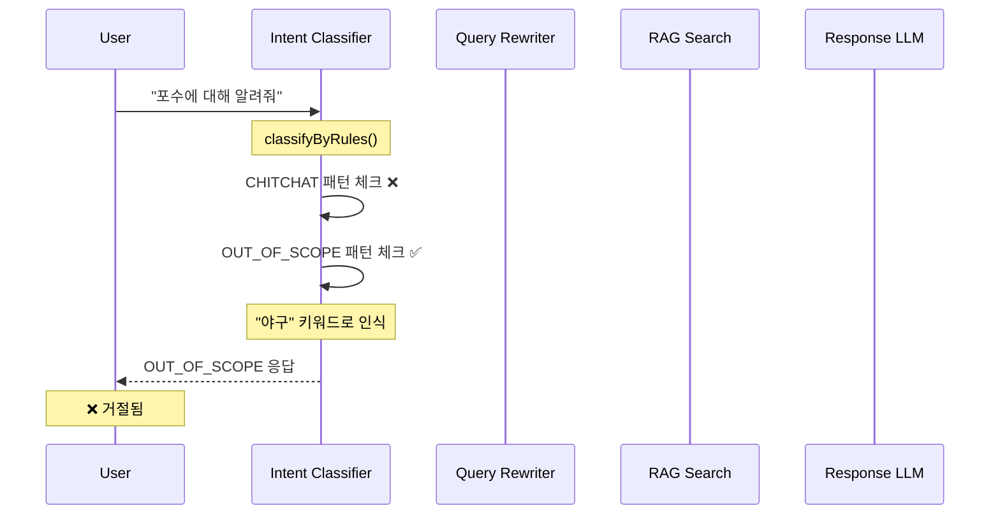
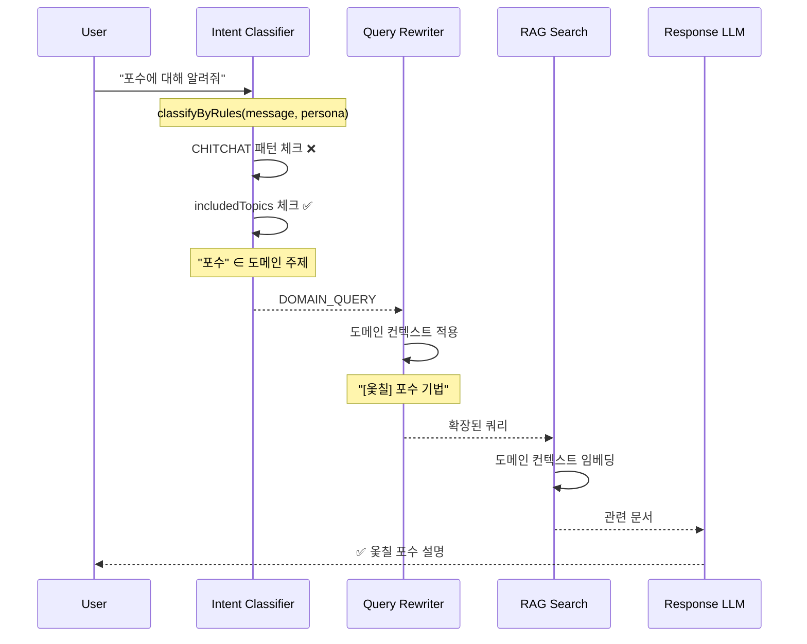

# RAG 동음이의어(Polysemy) 문제 해결

## 개요

**문제**: 도메인 특화 용어가 일반 용어로 오인되어 잘못된 응답을 생성하는 이슈

**예시**:
- 사용자 질문: "포수에 대해 알려줘"
- 의도: 옻칠 기법 **포수(布水)** - 옻칠 마감 기법
- 현재 동작: 야구 **포수(捕手)**로 해석 → OUT_OF_SCOPE → 거절 응답

**근본 원인**:
1. `classifyByRules()`가 persona를 받지 않아 도메인 키워드 우선 처리 불가
2. OUT_OF_SCOPE 패턴이 도메인 키워드보다 먼저 체크됨
3. 쿼리 재작성 시 도메인 컨텍스트가 LLM에 전달되지 않음

---

## 해결 전략

### 1. Domain-First Intent Classification
도메인 키워드를 OUT_OF_SCOPE 패턴보다 **먼저** 체크하여 도메인 용어 우선 처리

### 2. Domain-Aware Query Rewriting
LLM 쿼리 재작성 시 도메인 컨텍스트(전문 분야, 용어 사전) 전달

### 3. Search Query Domain Context Injection
임베딩 검색 쿼리에 도메인 컨텍스트 주입으로 검색 정확도 향상

---

## Phase 구성

| Phase | 주제 | 예상 시간 | 비용 | 상태 |
|-------|------|----------|------|------|
| [Phase 1](./phase-1-domain-first-classification.md) | Domain-First Intent Classification | 30분 | 0 | 🔴 |
| [Phase 2](./phase-2-domain-aware-rewriting.md) | Domain-Aware Query Rewriting | 1시간 | LLM 미미 | 🔴 |
| [Phase 3](./phase-3-search-context-injection.md) | Search Context Injection | 30분 | 0 | 🔴 |
| [Phase 4](./phase-4-persona-extension.md) | PersonaConfig 확장 | 30분 | 0 | 🔴 |

**총 예상 시간**: 2-3시간

---

## 아키텍처 다이어그램

### 현재 흐름 (문제)



### 개선 후 흐름 (목표)



---

## 핵심 결정 사항

| 결정 | 선택 | 이유 |
|------|------|------|
| 도메인 키워드 체크 순서 | OUT_OF_SCOPE 전에 | 도메인 우선 원칙 |
| 쿼리 재작성 LLM | 기존 generateWithFallback | 추가 비용 최소화 |
| 용어 사전 형식 | `Record<string, string>` | 간단하고 확장 가능 |
| 컨텍스트 주입 방식 | 프리픽스 `[domain]` | 임베딩 품질 유지 |

---

## 수정 파일 요약

| 파일 | Phase | 변경 유형 | 설명 |
|------|-------|----------|------|
| [lib/chat/intent-classifier.ts](../lib/chat/intent-classifier.ts) | 1, 4 | 수정 | classifyByRules에 persona 전달, PersonaConfig 확장 |
| [lib/rag/query-rewriter.ts](../lib/rag/query-rewriter.ts) | 2 | 수정 | 도메인 인지 프롬프트, 옵션 확장 |
| [lib/chat/service.ts](../lib/chat/service.ts) | 2 | 수정 | RAG 파이프라인에 도메인 정보 전달 |
| [lib/rag/retrieval.ts](../lib/rag/retrieval.ts) | 3 | 수정 | injectDomainContext 함수 추가 |

---

## 테스트 시나리오

### 테스트용 페르소나

```typescript
const ottchilPersona: PersonaConfig = {
  name: '옻칠 전문가',
  expertiseArea: '옻칠 기법 안내',
  includedTopics: ['옻칠', '포수', '생칠', '건칠', '주칠'],
  excludedTopics: ['야구', '스포츠', '프로그래밍'],
  tone: 'friendly',
  domainGlossary: {
    '포수': '布水, 옻칠 마감 기법으로 물을 뿌려 광택을 내는 과정',
    '생칠': '生漆, 옻나무에서 채취한 천연 옻',
    '건칠': '乾漆, 옻을 바른 후 건조시킨 상태',
  },
};
```

### 검증 케이스

| 시나리오 | 입력 | 현재 결과 | 기대 결과 |
|---------|------|----------|----------|
| 도메인 동음이의어 | "포수에 대해 알려줘" | OUT_OF_SCOPE | DOMAIN_QUERY → 옻칠 포수 설명 |
| 도메인 용어 | "생칠이 뭐야?" | 관련 없음 | DOMAIN_QUERY → 생칠 설명 |
| 명확한 외부 질문 | "야구 규칙 알려줘" | OUT_OF_SCOPE | OUT_OF_SCOPE (변경 없음) |
| 복합 질문 | "포수 기법의 역사" | OUT_OF_SCOPE | DOMAIN_QUERY |

---

## 구현 순서

```
Phase 1 (Domain-First Classification)
    ↓
Phase 4 (PersonaConfig 확장) ← Phase 2 의존성
    ↓
Phase 2 (Domain-Aware Rewriting)
    ↓
Phase 3 (Search Context Injection)
```

**권장 구현 순서**: Phase 1 → Phase 4 → Phase 2 → Phase 3

- Phase 1은 즉시 효과가 있고 비용이 0
- Phase 4는 Phase 2의 의존성이므로 먼저 구현
- Phase 2와 3은 추가 강화

---

## 환경 변수

기존 환경 변수 사용, 추가 설정 불필요:

```env
# 기존 (변경 없음)
GOOGLE_GENERATIVE_AI_API_KEY=xxx  # 쿼리 재작성용
OPENAI_API_KEY=xxx                # 폴백
```

---

## 참고 연구

이 구현은 다음 연구 및 기법을 기반으로 합니다:

1. **Contextual Retrieval** (Anthropic, 2024)
   - 청킹 시 컨텍스트 프리픽스 추가로 검색 실패율 49% 감소

2. **Query Rewriting/Expansion** (RQ-RAG, HyDE)
   - LLM 기반 쿼리 재작성으로 검색 품질 향상

3. **Hybrid Search**
   - Dense (Semantic) + Sparse (BM25) 검색 융합

4. **Domain-Specific Embedding**
   - 도메인 컨텍스트를 쿼리에 주입하여 임베딩 품질 향상

---

## 개발자 온보딩

### 프로젝트 배경

**SOFA**는 RAG 기반 챗봇 플랫폼입니다. 사용자는 자신만의 지식 베이스를 구축하고, 챗봇이 해당 지식에 기반하여 응답합니다.

### 핵심 파일 구조

```
lib/chat/
├── intent-classifier.ts    # Intent 분류 (CHITCHAT/DOMAIN_QUERY/OUT_OF_SCOPE)
├── service.ts              # 메인 채팅 서비스
├── query-router.ts         # 응답 전략 라우팅
└── types.ts                # 채팅 관련 타입

lib/rag/
├── query-rewriter.ts       # 쿼리 재작성 (히스토리 맥락 반영)
├── retrieval.ts            # 하이브리드 검색 (Dense + Sparse)
├── generator.ts            # LLM 응답 생성
└── types.ts                # RAG 관련 타입
```

### 디버깅 가이드

**Intent 분류 확인**:
```typescript
// lib/chat/intent-classifier.ts
logger.debug('Intent classified by rules', {
  message: message.slice(0, 50),
  intent: rulesResult.intent,
  duration: Date.now() - startTime,
});
```

**쿼리 재작성 확인**:
```typescript
// lib/rag/query-rewriter.ts
logger.info('[KeywordExpansion] Query expanded', {
  original: query,
  expanded: expandedQuery,
  addedKeywords: uniqueExpansions,
});
```

---

*문서 작성일: 2026-01-19*
*상태: 구현 대기*
